# Звіт: Налаштування ZAP DAST для juice-shop

## Мета
Інтеграція OWASP ZAP у GitHub Actions для виконання динамічного тестування безпеки (DAST) вебзастосунку juice-shop.

---

## Крок 1: Підготовка репозиторію
Створено власний репозиторій `juice-shop-github-actions.Lab3` на основі існуючого проєкту. Репозиторій містить файл `.github/workflows/zap_DAST.yml` з базовою конфігурацією ZAP сканування та змінами для генерації звітних файлів.

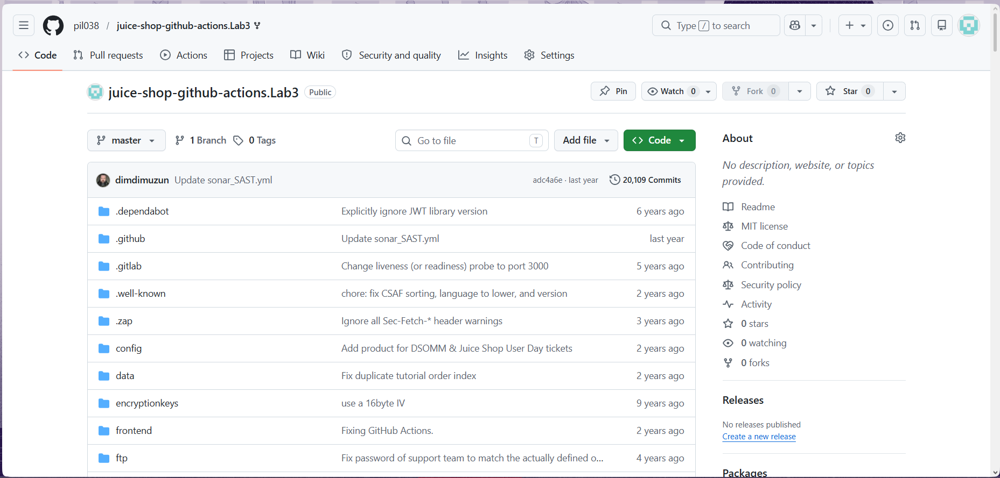
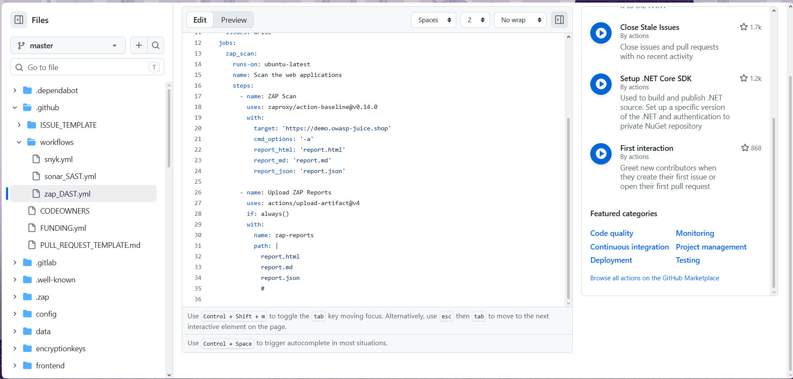

---

## Крок 2: Перший запуск workflow
Після першого commit всі три workflow запустились автоматично. Workflow DAST запустився але завершився з помилкою через відсутність Issues у репозиторії.

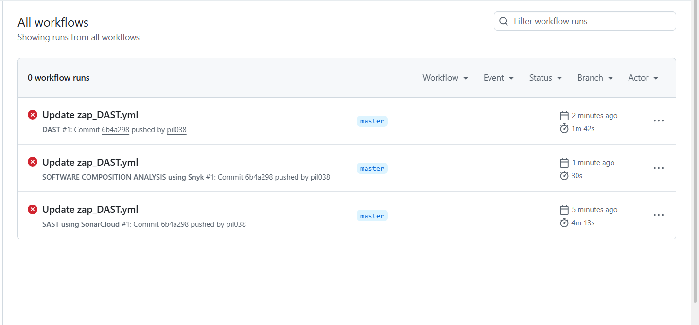

---

## Крок 3: Аналіз помилки першого запуску
DAST #1 завершився з Failure за 1m 42s. В Annotations виявлено дві проблеми:
- `Issues has been disabled in this repository` — ZAP намагається створити GitHub Issue з результатами, але функція вимкнена
- `Unexpected input(s) 'report_html', 'report_md', 'report_json'` — невалідні параметри у першій версії workflow

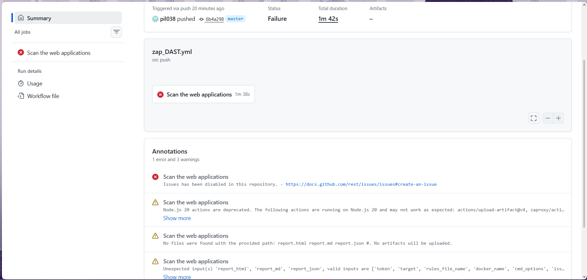

---

## Крок 4: Детальний перегляд логів помилки
У логах кроку ZAP Scan підтверджено причину падіння:
```
Error: Issues has been disabled in this repository.
```
Сканування фактично завершилось успішно (WARN-NEW: 7, PASS: 63), але workflow впав на спробі створити Issue з результатами.

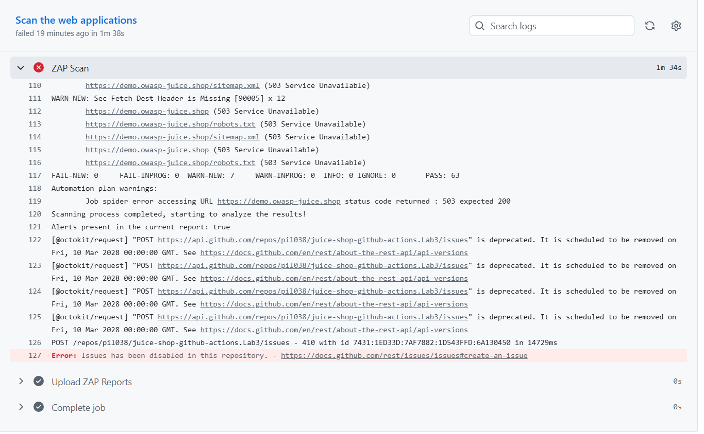

---

## Крок 5: Увімкнення Issues у репозиторії
Для виправлення помилки перейдено до `Settings → General → Features` та увімкнено **Issues**.

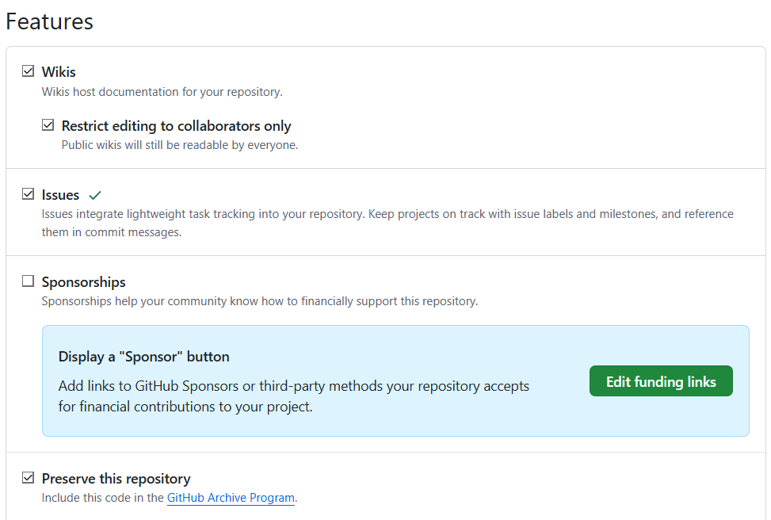

---

## Крок 6: Доопрацювання workflow — додавання збереження звітів
Оновлено файл `zap_DAST.yml`: додано крок `Upload ZAP Reports` для збереження звітів як GitHub Actions Artifacts. Використано стандартні імена файлів які ZAP генерує автоматично: `report.html`, `report.md`, `report.json`.

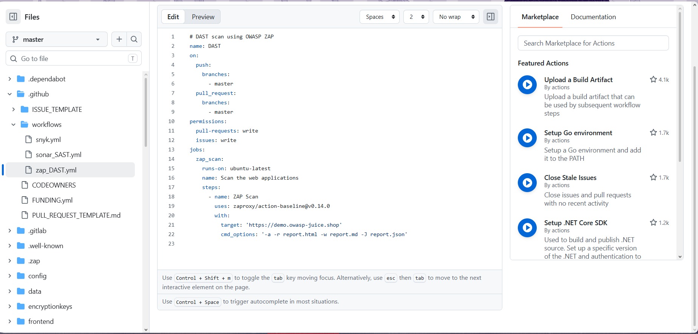

---

## Крок 7: Фінальна версія workflow
Минула версія коду мала недолік і через це стався конфлікт.
Фінальний файл `.github/workflows/zap_DAST.yml`:

```yaml
# DAST scan using OWASP ZAP
name: DAST
on:
  push:
    branches:
      - master
  pull_request:
    branches:
      - master
permissions:
  pull-requests: write
  issues: write
jobs:
  zap_scan:
    runs-on: ubuntu-latest
    name: Scan the web applications
    steps:
      - name: ZAP Scan
        uses: zaproxy/action-baseline@v0.14.0
        with:
          target: 'https://demo.owasp-juice.shop'
          cmd_options: '-a'

      - name: Upload ZAP Reports
        uses: actions/upload-artifact@v4
        if: always()
        with:
          name: zap-reports
          path: |
            report_html.html
            report_md.md
            report_json.json
```

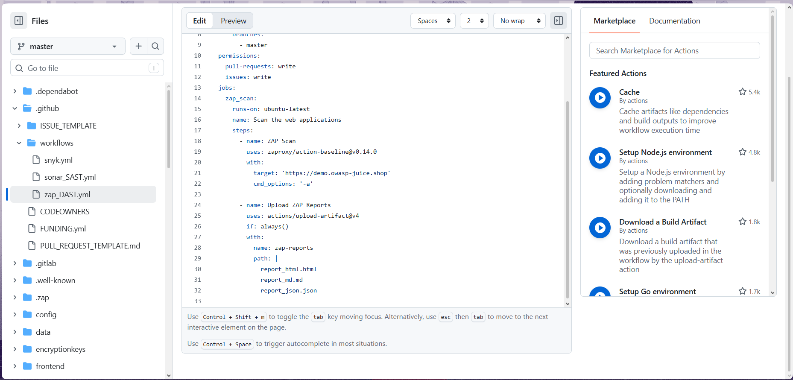

---

## Крок 8: Успішний запуск DAST #3
Після виправлень DAST #3 завершився зі статусом **Success** за 1m 36s. Артефакти: **2**.

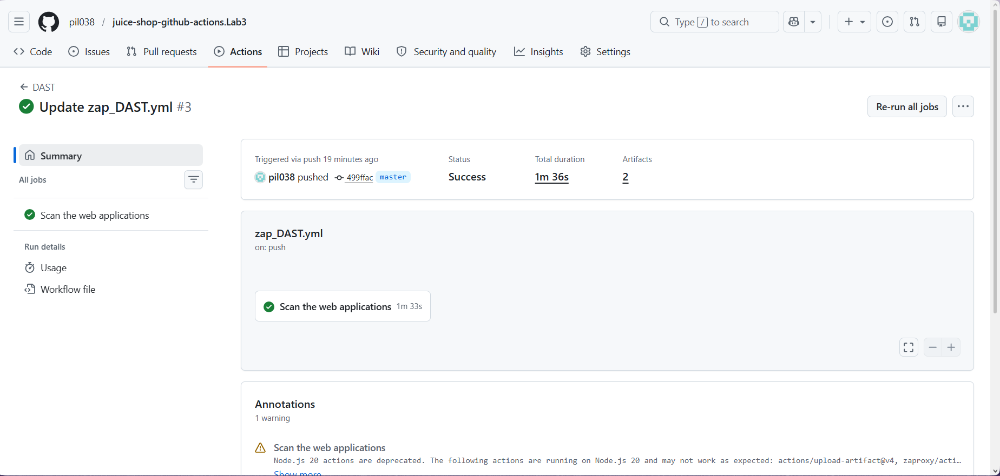

---

## Крок 9: Збережені артефакти зі звітами
У розділі Artifacts доступні два артефакти:
- `zap-reports` (37.4 KB) — завантажений нашим кроком Upload
- `zap_scan` (37.4 KB) — автоматично збережений ZAP action

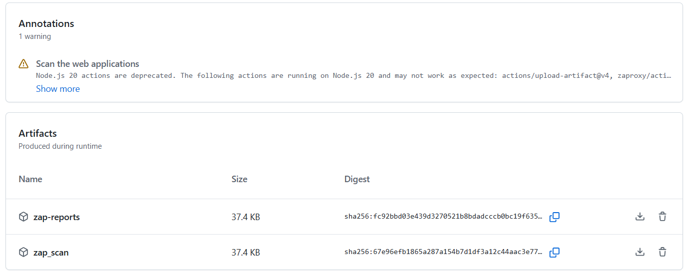

---

## Крок 10: Результати сканування — зведена таблиця
Завантажено архів `zap-reports` з трьома файлами звітів: `report_html.html`, `report_md.md`, `report_json.json`.
ZAP просканував **158 URL** на `https://demo.owasp-juice.shop` та виявив:

| Рівень ризику | Кількість алертів |
|---|---|
| 🔴 High | 0 |
| 🟡 Medium | 2 |
| 🔵 Low | 7 |
| ⚪ Informational | 9 |
| **Всього** | **18** |

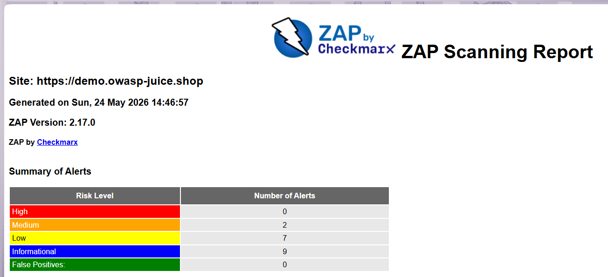

---

## Крок 11: Детальні результати — список алертів

| Назва | Рівень | Екземплярів |
|---|---|---|
| Content Security Policy (CSP) Header Not Set | Medium | Systemic |
| Cross-Domain Misconfiguration | Medium | Systemic |
| Cross-Origin-Embedder-Policy Header Missing | Low | 3 |
| Cross-Origin-Opener-Policy Header Missing | Low | 3 |
| Dangerous JS Functions | Low | 1 |
| Deprecated Feature Policy Header Set | Low | Systemic |
| Server Leaks Version Information | Low | 3 |
| Strict-Transport-Security Header Not Set | Low | Systemic |
| Timestamp Disclosure - Unix | Low | Systemic |
| Base64 Disclosure | Informational | 7 |
| Modern Web Application | Informational | 2 |
| Re-examine Cache-control Directives | Informational | 3 |
| Sec-Fetch-Dest Header is Missing | Informational | 4 |
| Sec-Fetch-Mode Header is Missing | Informational | 4 |
| Sec-Fetch-Site Header is Missing | Informational | 4 |
| Sec-Fetch-User Header is Missing | Informational | 4 |
| Storable and Cacheable Content | Informational | 1 |
| Storable but Non-Cacheable Content | Informational | Systemic |

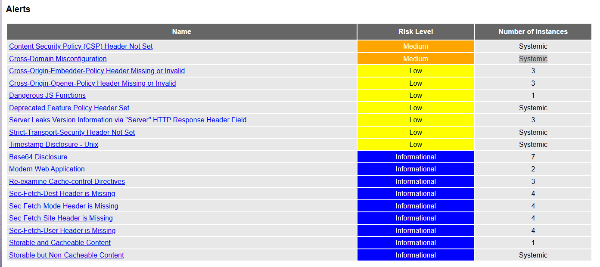

---

## Крок 12: GitHub Issue створений ZAP
Після успішного сканування ZAP автоматично створив GitHub Issue у репозиторії з детальними результатами та переліком всіх знайдених вразливостей.

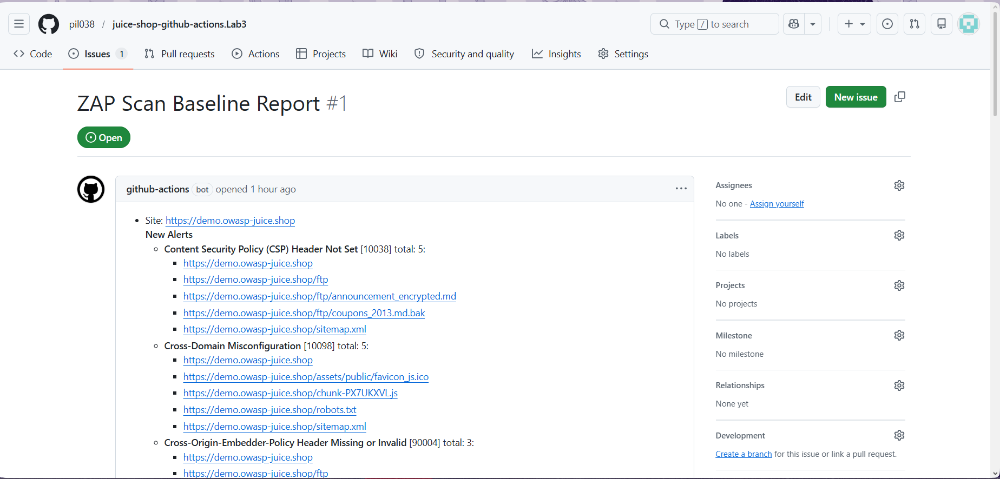

---

## Висновок
Успішно налаштовано GitHub Actions Workflow для інтеграції OWASP ZAP DAST:
- Workflow автоматично запускається при кожному push або PR до гілки `master`
- ZAP сканує вебзастосунок ззовні, імітуючи реальні HTTP-запити до `https://demo.owasp-juice.shop`
- Виявлено **18 алертів**: 2 Medium, 7 Low, 9 Informational — жодних критичних (High)
- Звіти автоматично зберігаються у трьох форматах (HTML, Markdown, JSON) як GitHub Actions Artifacts
- ZAP автоматично створює GitHub Issue з результатами сканування для зручного відстеження

Основні знайдені проблеми пов'язані з відсутністю захисних HTTP-заголовків (`CSP`, `HSTS`, `CORP`) — це очікуваний результат для навмисно вразливого застосунку Juice Shop.
